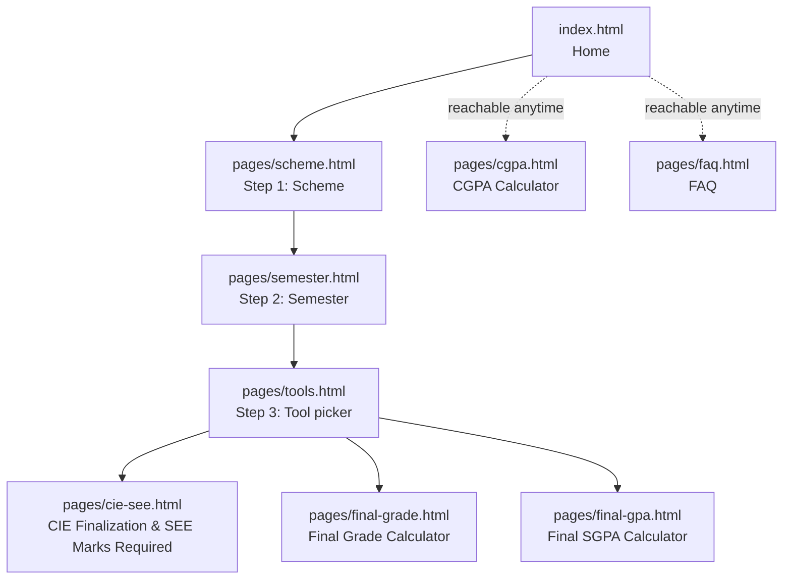
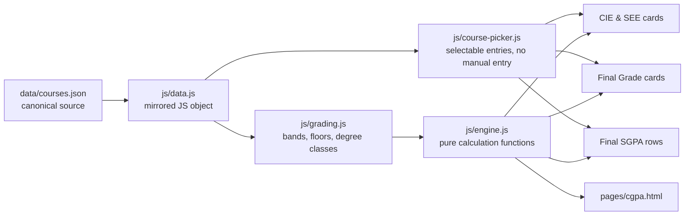

# RVCE MCA Grade Calculator


[](https://firebase.google.com/)


> An unofficial CIE, SEE, final-grade and GPA calculator for RVCE MCA (Master of Computer Applications) students, built directly from the college's own published rules rather than guesswork.

This project walks a student through their scheme and semester, then opens a calculator that is already pre-loaded with that semester's real courses, credit values and CIE/SEE structure. Every course sits on its own card so multiple subjects can be worked through side by side, and nothing is calculated, finalized or shown as a passing grade until every field that matters for that subject has actually been filled in.

The two documents this app is built from:

- *Academic Planning, Assessment & Evaluation Handbook, Guidelines and Information of Postgraduate Programs* (w.e.f. 2024-25)
- *MCA 2024 Scheme and Syllabus, Semester I-IV*

**Disclaimer: this is not an official RVCE tool, and no responsibility is taken for discrepancies.** It is an independent student project, not affiliated with or endorsed by R V College of Engineering. Always check your official grade card and the Controller of Examinations for anything that actually matters.

## Table of Contents

- [Overview](#overview)
- [Key Features](#key-features)
- [Technology Stack](#technology-stack)
- [System Architecture](#system-architecture)
  - [Navigation Flow](#navigation-flow)
  - [Course Data Flow](#course-data-flow)
- [The Five Calculators](#the-five-calculators)
- [CIE Breakdown by Semester](#cie-breakdown-by-semester)
- [Input Validation](#input-validation)
- [Course Data Is Fixed, Not Freehand](#course-data-is-fixed-not-freehand)
- [Design](#design)
- [Repository Structure](#repository-structure)
- [Running It](#running-it)
- [Data Accuracy](#data-accuracy)
- [Contributing](#contributing)
- [Contact](#contact)
- [License](#license)
- [Credits](#credits)

## Overview

RVCE revises the MCA scheme roughly every two academic years, and every revision changes course codes, credit weights, and sometimes the CIE breakdown itself. Rather than a single generic "enter your marks" form, this project encodes the actual current scheme as structured data, and every calculator reads from that data instead of asking the student to remember or retype it.

The site is a plain set of statically linked HTML pages: `index.html` at the project root, and everything else one level down in `pages/`. There is no single-page app router and no client-side framework. Query-string parameters (`?scheme=2024&semester=I`) carry the student's place in the wizard from page to page, so a bookmarked or shared link resolves correctly on its own, and the browser's back and forward buttons behave exactly as expected.

## Key Features

**Guided Navigation**
- A three-step wizard (Scheme, Semester, Tool) that narrows down to the exact calculator needed, with a breadcrumb trail on every page for jumping back. The header itself is a single navbar row at every screen size — on narrow screens the nav links, sign-in control and theme toggle collapse behind a hamburger button instead of the header growing extra rows.
- Every step's query string is validated on load; an invalid or missing parameter redirects back to scheme selection instead of rendering a broken page.

**Course-Card Layout**
- Every course in the chosen semester appears as its own card, side by side, on both the CIE Finalization page and the Final Grade Calculator. Nothing is tucked behind a single dropdown.
- Calculating one course's marks has no effect on any other card on the page.

**CIE Finalization & SEE Marks Required**
- Quiz I, II and III and Test I, II and III are entered as they are actually run; only the best two of each three are counted.
- Once a course's CIE is calculated, its SEE Marks Required button unlocks and opens a popup listing the SEE score needed for every passing grade at once, from O down to C, instead of one target at a time.
- For a course with a lab component, an optional field lets a student fix the Lab SEE and see the exact Theory SEE needed around it.

**Final Grade Calculator**
- Takes just the two numbers that actually end up on a grade card: finalized CIE total and SEE total.
- Checked against the Table 4.4 total-row passing conditions (CIE at least 50%, SEE at least 40% for a theory-only course or 50% for a course with a lab component, aggregate at least 50%), with no quiz, test or lab sub-breakdown required at this stage.

**Final SGPA Calculator**
- SGPA for a single semester, shown as one row per real course with its own grade dropdown, plus a CGPA blend directly underneath: enter a CGPA and credit total through the previous semester and it merges automatically with the SGPA just computed.
- The full, detailed semester-by-semester CGPA Calculator is still available separately for anyone who wants that instead.

**CGPA Calculator**
- Weighted across all four semesters, with a live progress bar toward the MCA program's 80-credit total and a projected degree class (First Class with Distinction, First Class, or Second Class).

**FAQ**
- A plain-language explanation of every formula the app uses, sourced from the same two documents as the calculators themselves.

**Guide**
- A plain-language walkthrough of what each calculator is actually for and the point in the semester you'd reach for it — from mid-semester CIE tracking, to a post-CIE/pre-SEE or post-exam grade estimate, to verifying SGPA against the SAP portal once results are out, to projecting a future CGPA.

**Google Sign-In & Save Progress**
- Every calculator has a Save Progress button, gated behind Google Sign-In restricted to RVCE MCA student emails (the `<name>.mca<YY>@rvce.edu.in` format, `YY` being the enrollment year). Signed out, every calculator works identically — nothing is gated behind sign-in except persisting your entries between visits.
- Data is stored in Firestore, scoped so a signed-in student can only ever read or write their own document (enforced server-side in `firestore.rules`, not just hidden in the UI). There is currently no automatic expiry on this data — it persists indefinitely until the student explicitly clears it or the project's Firestore data is manually purged; there is no scheduled deletion job.

**Installable, Works Offline**
- A PWA manifest and service worker mean the site can be installed to a home screen / as a desktop app, and previously visited pages keep working without a connection. Firebase Auth and Firestore requests always go straight to the network — offline mode covers browsing the calculators, not saving new data while offline.

Only the 2024 scheme is implemented today. A 2026 scheme option is visible on the scheme-selection page but disabled and marked "Coming soon" until that syllabus is published and added.

## Technology Stack

| Layer | Technology |
| ----- | ----- |
| Markup | Plain HTML, one file per page |
| Styling | Plain CSS, no preprocessor, split into `variables.css`, `base.css`, `layout.css`, `components.css` |
| Logic | Vanilla JavaScript, ES5-style function scoping, no framework |
| Data | A single `data/courses.json` file, mirrored as a plain JS object in `js/data.js` |
| Persistence & Auth | Firebase Authentication (Google Sign-In, restricted to RVCE MCA emails) + Firestore, used only for the optional Save Progress feature |
| Offline / Installable | A web app manifest (`manifest.webmanifest`) + service worker (`sw.js`) for offline browsing and home-screen installation |
| Fonts | Google Fonts (Inter and JetBrains Mono), loaded via a standard `<link>` tag |
| Build tooling | None. There is no bundler, transpiler or install step of any kind |

`js/data.js` mirrors `data/courses.json` as a plain JS object, so the browser never needs to `fetch()` anything at runtime. That keeps the app fully working even when `index.html` is opened directly from disk, with no server involved at all — the one exception is Google Sign-In and Save Progress, which require the page to be served over `http://` or `https://` (Firebase Hosting, or any local static server); Google's sign-in popup will not work against a `file://` URL.

## System Architecture

### Navigation Flow



Scheme is chosen before semester because it is what actually determines everything downstream. The course list, credit structure and CIE/SEE weightage for all four semesters are fixed once per scheme, so locking that choice in first keeps the rest of the wizard consistent. Semester selection groups the four semesters under Year 1 / Year 2 headings on one page, rather than a separate year-selection step, since knowing the semester number is all any calculator downstream actually needs.

### Course Data Flow



`js/engine.js` contains no DOM code at all; it is a set of pure functions that take plain values in and return plain result objects out. Every page-level script in `js/pages/` calls into the same engine and renders the result itself, so the CIE math, the SEE math and the grading math can never drift out of sync between pages.

## The Five Calculators

| Tool | File | What it needs | What it returns |
| ----- | ----- | ----- | ----- |
| CIE Finalization & SEE Marks Required | `pages/cie-see.html` | Quiz I-III, Test I-III, EL/PBL, Lab marks | Finalized CIE, plus SEE needed for every grade band |
| Final Grade Calculator | `pages/final-grade.html` | Finalized CIE total, SEE total | Letter grade, grade point, pass/fail against Table 4.4 |
| Final SGPA Calculator | `pages/final-gpa.html` | A grade for every course in the semester | SGPA, plus an optional CGPA blend with a prior CGPA |
| CGPA Calculator | `pages/cgpa.html` | SGPA for each completed semester | CGPA, credit progress bar, projected degree class |
| FAQ | `pages/faq.html` | Nothing, reference only | Plain-language explanation of every formula above |

## CIE Breakdown by Semester

The Quiz and Test split is identical in every semester: three quizzes out of 10 each (best two count, out of 20), and three tests out of 50 each (best two count, scaled down to 40). What sits alongside that, for a course with an integrated lab, changes by semester:

- **Semester I** follows Table 4.2.2 as published: Experiential Learning (out of 40) on the theory side, plus a single combined Lab (record + test) mark out of 50, for a CIE out of 150 in total.
- **Semesters II and III** use the college's own current practice instead: **PBL (Project Based Learning)** stands in for the theory-side Experiential Learning mark, at the same 40-mark weight and the same role in the floor checks, alongside a single 50-mark Lab / Practical CIE. Quiz+Test (60) + PBL (40) + Lab (50) totals the same 150 as Semester I. The PBL label itself is not in the published handbook table, but `js/engine.js` applies the same floor conditions to it as it would to EL, and says so explicitly in the note shown under each result.

## Input Validation

Every numeric field has a hard minimum and maximum. Typing a value above a field's maximum clamps it back down immediately, with an inline warning naming the actual limit. This runs through a single delegated listener (`js/input-guard.js`) rather than being wired up field by field, so it automatically covers new fields added later too.

On top of that, both the CIE Finalization page and the Final Grade Calculator require every relevant field for a given course to be filled in before that course's result is shown at all. Pressing Calculate on a card with any field still empty highlights the empty fields, shows a message naming how many are missing, and leaves the result and the SEE Marks Required button locked, so a partially filled course never displays a mark, a percentage or a grade that looks final when it is not. This check applies per course card: finishing one subject's marks does not unlock or affect any other subject on the same page.

## Course Data Is Fixed, Not Freehand

Every course list in this app, in the CIE/SEE tool, the Final Grade tool and the Final SGPA table, is read directly from `data/courses.json` for the semester selected, and that is the only source a calculator will ever use. There is no manual or custom course entry point anywhere in the interface: course names, credit values and CIE/SEE structure cannot be typed in or edited by hand. This is deliberate. It keeps every result traceable back to an actual line in the syllabus, and it means the numbers cannot silently drift from what the scheme says. Professional elective groups are still selectable by their actual elective title; the underlying CIE/SEE/credit structure for the group is fixed regardless of which elective within it is chosen.

If a course is missing or a value looks wrong, please open an issue on the GitHub repository rather than editing it locally. See [Data Accuracy](#data-accuracy).

## Design

The visual language (white cards on a soft gray gradient, rounded corners, a single near-black primary action color, blue reserved for focus states, green and red for pass and fail) is a from-scratch CSS implementation with no build tooling behind it.

Course-picker, tool-picker and semester-picker cards use small colored icon badges built from inline SVG, not emoji, so the wizard reads as a set of distinct destinations rather than a wall of identical white boxes. `js/icons.js` holds the shared icon set.

A light and dark toggle sits in the header on every page. Dark mode is a soft charcoal surface rather than pure black, so it stays comfortable during long study sessions. The choice is remembered through `localStorage` and applied before the page paints, so there is no flash of the wrong theme on reload.

The header is a single navbar row at any screen width. On wide screens the nav links, sign-in control and theme toggle sit inline next to the brand; below a breakpoint they collapse behind a hamburger button into a dropdown panel instead of the header itself growing extra rows. GitHub is linked from the footer only, not the header.

The footer is intentionally minimal: one short paragraph, one row of links, the syllabus PDF choice, and a legal line, rather than a dense multi-column grid of repeated headings.

## Repository Structure

```
rvce-mca-grade-calculator/
│
├── index.html                    Home (must stay at the project root)
├── 404.html                       Custom not-found page
├── manifest.webmanifest           PWA manifest
├── sw.js                          Service worker (offline + caching)
├── robots.txt, sitemap.xml        SEO
├── firebase.json                  Firebase Hosting config, security headers, CSP
├── firestore.rules                Firestore access rules (RVCE MCA emails only, own-document only)
├── firestore.indexes.json         Firestore index config (currently empty — no composite queries)
├── icons/                         PWA icon set + favicon source
├── pages/
│   ├── scheme.html                 Step 1: scheme selection
│   ├── semester.html               Step 2: semester selection (Year 1 / Year 2 grouped)
│   ├── tools.html                  Step 3: calculator picker for a semester
│   ├── cie-see.html                CIE Finalization & SEE Marks Required
│   ├── final-grade.html            Final Grade Calculator
│   ├── final-gpa.html              Final SGPA Calculator (+ CGPA blend)
│   ├── cgpa.html                   CGPA Calculator (all semesters)
│   ├── guide.html                  What each calculator is for and when to use it
│   └── faq.html                    FAQ
├── css/
│   ├── variables.css               design tokens: colors, type, radii
│   ├── base.css                    resets and base typography
│   ├── layout.css                  site header (single-row + hamburger), page hero, breadcrumb
│   └── components.css              cards, forms, tables, buttons, FAQ, footer, guide page
├── js/
│   ├── data.js                     MCA course data and grading constants (mirrors data/courses.json)
│   ├── grading.js                  shared grading-table helpers (letter to grade point, etc.)
│   ├── engine.js                   pure calculation functions: CIE, SEE, final grade, SGPA, CGPA
│   ├── course-picker.js            restricts every course dropdown to data.js, no manual entry
│   ├── input-guard.js              clamps every numeric field to its min/max, shows a warning
│   ├── util.js                     shared escaping/formatting/toast helpers
│   ├── firebase-auth.js            Google Sign-In (RVCE MCA emails only) + Firestore save/load
│   ├── progress.js                 generic Save Progress serialization used by every calculator page
│   ├── pwa-register.js             registers the service worker
│   ├── icons.js                    shared inline-SVG icon set for the colored badges
│   ├── faqContent.js               FAQ question and answer content
│   ├── site.js                     shared header, footer, breadcrumb, path and query-string helpers
│   └── pages/                      one small script per HTML page, wiring that page only
│       ├── scheme.js, semester.js, tools.js
│       ├── cie-see.js, final-grade.js, final-gpa.js
│       └── cgpa.js, faq.js, guide.js
├── data/
│   └── courses.json                canonical course data: semester to courses, credits, CIE/SEE max, syllabus page
└── docs/
    ├── MCA-2024-Scheme-Syllabus.pdf   the source syllabus, linked from the app
    └── PG-2024-Scheme-Handbook.pdf    the source academic handbook, linked from the app
```

`index.html` has to stay at the project root for the site to open correctly at its root URL (for example, on GitHub Pages); every other page lives one level down in `pages/`. `js/site.js` works out which of the two contexts it is running in and adjusts every link it generates accordingly, so nothing else needs to know or care where a given page physically lives.

## Running It

There is no build step of any kind. Any of the following works:

```bash
# just open it directly
open index.html          # macOS
# or double-click index.html in your file browser

# or serve it locally with any static file server you already have,
# for example Python's built-in one, from the project root:
python3 -m http.server 5173
```

Because `js/data.js` mirrors `data/courses.json` as a plain JS object, the app works identically whether it is opened straight from disk or served over HTTP; nothing needs to be fetched at runtime.

## Data Accuracy

Course codes, titles, credits and CIE/SEE marks for all four semesters were transcribed from the RVCE 2024 Scheme syllabus PDF (`docs/`). The grading table, passing standards, CIE scheme and credit-distribution rules come from the PG Academic Handbook. If RVCE revises either document, `data/courses.json` (mirrored in `js/data.js`) and `js/grading.js` are the two places to update; every page reads from them, so nothing else needs to change.

## Contributing

Contributions are welcome!

1. Fork the repository.
2. Create a new branch: `git checkout -b feature-new-feature`
3. Make your changes and commit them: `git commit -m 'Add new feature'`
4. Push to the branch: `git push origin feature-new-feature`
5. Open a pull request.

Please follow consistent coding styles and include clear commit messages. Please also keep contributions consistent with the "no manual course entry" design described above: corrections belong in `data/courses.json`, not in the calculator forms.

## Contact

- GitHub repository: <https://github.com/Rajlohith/rvce-mca-grade-calculator>
- Email: <brlohithraj.mca25@rvce.edu.in>
- Official RVCE scheme and syllabus: <https://rvce.edu.in/academics_and_examinations/rvce_scheme_syllabus/>

## License

Licensed under the [Apache License, Version 2.0](LICENSE). See `NOTICE` for the required attribution notice. In short: you may use, modify and redistribute this project, including for commercial purposes, provided you retain the copyright and license notices and clearly mark any changes you make. Just do not present a modified copy as an official RVCE tool.

## Credits

Major inspiration drawn for creating this project from an existing live project facilitating UG programs at RVCE.

Repo: https://github.com/Vidisha231106/rvce-grade-calculator

Site: https://rvce-grade-calculator.vercel.app/
