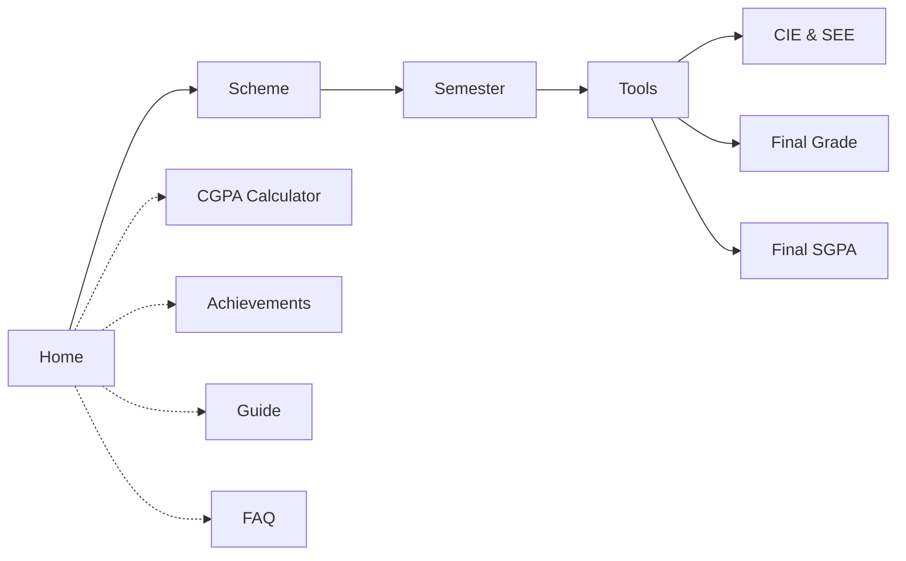
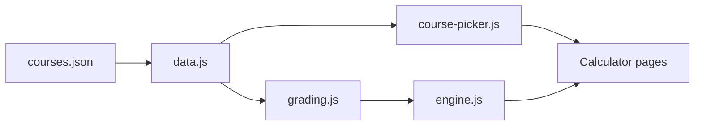

# RVCE MCA Grade Calculator


[](https://firebase.google.com/)


> An unofficial CIE, SEE, final-grade and GPA calculator for RVCE MCA (Master of Computer Applications) students, built directly from the college's own published rules rather than guesswork.

This project walks a student through their scheme and semester, then opens a calculator that is already pre-loaded with that semester's real courses, credit values and CIE/SEE structure. Every course sits on its own card so multiple subjects can be worked through side by side, and nothing is calculated, finalized or shown as a passing grade until every field that matters for that subject has actually been filled in.

The two documents this app is built from:

- *Academic Planning, Assessment & Evaluation Handbook, Guidelines and Information of Postgraduate Programs* (w.e.f. 2024-25)
- *MCA 2024 Scheme and Syllabus, Semester I-IV*

**Disclaimer: this is not an official RVCE tool, and no responsibility is taken for discrepancies.** It is an independent student project, not affiliated with or endorsed by R V College of Engineering. Always check your official grade card and the Controller of Examinations for anything that actually matters.

## Table of Contents

- [Overview](#overview)
- [Key Features](#key-features)
- [Technology Stack](#technology-stack)
- [System Architecture](#system-architecture)
  - [Navigation Flow](#navigation-flow)
  - [Course Data Flow](#course-data-flow)
- [The Four Calculators](#the-four-calculators)
- [Beat Yourself & MCA Journey](#beat-yourself--mca-journey)
- [CIE Breakdown by Semester](#cie-breakdown-by-semester)
- [Passing Floors & Rounding](#passing-floors--rounding)
- [Input Validation](#input-validation)
- [Course Data Is Fixed, Not Freehand](#course-data-is-fixed-not-freehand)
- [Design](#design)
- [Repository Structure](#repository-structure)
- [Running It](#running-it)
- [Build, Docker & Deployment](#build-docker--deployment)
- [Data Accuracy](#data-accuracy)
- [Contributing](#contributing)
- [Contact](#contact)
- [License](#license)
- [Credits](#credits)

## Overview

RVCE revises the MCA scheme roughly every two academic years, and every revision changes course codes, credit weights, and sometimes the CIE breakdown itself. Rather than a single generic "enter your marks" form, this project encodes the actual current scheme as structured data, and every calculator reads from that data instead of asking the student to remember or retype it.

The site is a plain set of statically linked HTML pages: `index.html` at the project root, and everything else one level down in `pages/`. There is no single-page app router and no client-side framework. Query-string parameters (`?scheme=2024&semester=I`) carry the student's place in the wizard from page to page, so a bookmarked or shared link resolves correctly on its own, and the browser's back and forward buttons behave exactly as expected.

## Key Features

**Guided Navigation**
- A three-step wizard (Scheme, Semester, Tool) that narrows down to the exact calculator needed, with a breadcrumb trail on every page for jumping back. The header itself is a single navbar row at every screen size — on narrow screens the nav links, sign-in control and theme toggle collapse behind a hamburger button instead of the header growing extra rows.
- Every step's query string is validated on load; an invalid or missing parameter redirects back to scheme selection instead of rendering a broken page.

**Course-Card Layout**
- Every course in the chosen semester appears as its own card, side by side, on both the CIE Finalization page and the Final Grade Calculator. Nothing is tucked behind a single dropdown.
- Calculating one course's marks has no effect on any other card on the page.

**CIE Finalization & SEE Marks Required**
- Quiz I, II and III and Test I, II and III are entered as they are actually run; only the best two of each three are counted.
- Once a course's CIE is calculated, its SEE Marks Required button unlocks and opens a popup listing the SEE score needed for every passing grade at once, from O down to C, instead of one target at a time.
- For a course with a lab component, an optional field lets a student fix the Lab SEE and see the exact Theory SEE needed around it.
- A course that misses its CIE floor is marked **DX** (not eligible to sit the SEE), so its SEE Marks Required button stays locked and reads "Not Eligible for SEE (DX)" instead of showing a meaningless projection.
- Semester IV's **Technical Seminar** has its own card type: it is evaluated as two internal project phases (Phase 1 and Phase 2, 50 marks each) rather than through the Quiz/Test/Lab framework, and since there is no university-conducted SEE for it, it has no SEE Marks Required button.
- The finalized CIE follows the department's convention of rounding **up** to the next whole mark; see [Passing Floors & Rounding](#passing-floors--rounding).

**Final Grade Calculator**
- Takes just the two numbers that actually end up on a grade card: finalized CIE total and SEE total.
- Checked against the Table 4.4 total-row passing conditions (CIE at least 50%, aggregate at least 50%, and an SEE floor that depends on the course type), with no quiz, test or lab sub-breakdown required at this stage. The SEE floor is 40% for a theory-only course, 40% for a Semester I theory + lab course, 50% for a Semester II or III theory + lab course (PBL scheme), and 50% for lab-only courses.
- For the Technical Seminar the two inputs are relabeled Project Phase 1 and Project Phase 2 instead of CIE and SEE.

**Final SGPA Calculator**
- SGPA for a single semester, shown as one row per real course with its own grade dropdown, plus a CGPA blend directly underneath: enter a CGPA and credit total through the previous semester and it merges automatically with the SGPA just computed.
- Every course row also accepts the handbook's transitional grades (W, I, X, DX and AB), which are left out of the SGPA calculation rather than counted as zero. Project, internship and NPTEL courses, which have no Quiz/Test/Lab marks to finalize, appear only in this table and in the CGPA Calculator, where their grade is picked directly.
- The full, detailed semester-by-semester CGPA Calculator is still available separately for anyone who wants that instead.

**CGPA Calculator**
- Weighted across all four semesters, with a live progress bar toward the MCA program's 80-credit total and a projected degree class (First Class with Distinction, First Class, or Second Class).

**FAQ**
- A plain-language explanation of every formula the app uses, sourced from the same two documents as the calculators themselves.

**Guide**
- A plain-language walkthrough of what each calculator is actually for and the point in the semester you'd reach for it — from mid-semester CIE tracking, to a post-CIE/pre-SEE or post-exam grade estimate, to verifying SGPA against the SAP portal once results are out, to projecting a future CGPA.

**Google Sign-In & Save Progress**
- Every calculator has a Save Progress button, gated behind Google Sign-In restricted to RVCE MCA student emails (the `<name>.mca<YY>@rvce.edu.in` format, `YY` being the enrollment year). Signed out, every calculator works identically — nothing is gated behind sign-in except persisting your entries between visits.
- Data is stored in Firestore, scoped so a signed-in student can only ever read or write their own document (enforced server-side in `firestore.rules`, not just hidden in the UI). There is currently no automatic expiry on this data — it persists indefinitely until the student explicitly clears it or the project's Firestore data is manually purged; there is no scheduled deletion job.

**Achievements**
- A collectible set of badges (`pages/achievements.html`) that unlock as a signed-in student actually uses the site — calculating a CIE, sweeping every course in a semester, hitting a perfect CIE, saving progress, toggling dark mode, reading the FAQ or Guide, and more. Some badges are hidden until unlocked and shown only as "Hidden Achievement" until then.
- Like Save Progress, this is entirely opt-in: nothing is tracked or stored for a signed-out visitor. Unlocked state is stored in the same per-student Firestore document as saved marks and progress (`userMarks/{uid}`, under an `achievements` field) — no separate collection or rules.

**Installable, Works Offline**
- A PWA manifest and service worker mean the site can be installed to a home screen / as a desktop app, and previously visited pages keep working without a connection. Firebase Auth and Firestore requests always go straight to the network — offline mode covers browsing the calculators, not saving new data while offline.
- A polite install prompt (`js/pwa-install.js`) offers "Add to Home Screen" only when it will not be annoying: never on a first visit, only after the visitor has interacted with the page, at most once per session, and with progressively longer snooze periods (14, 45, then 120 days) after each dismissal, until it stops asking altogether. On iOS Safari, which has no install API, it shows the manual Share → Add to Home Screen hint instead.
- When launched from an installed app, a branded splash screen covers the first page load of the session.

**Fast Loading**
- Every page loads minified scripts (`*.min.js`) and a single bundled stylesheet (`css/app.css`), generated from the readable sources by `npm run build`. See [Build, Docker & Deployment](#build-docker--deployment).
- The Firestore SDK is only fetched once a student is actually signed in (a small hint remembered in `localStorage` lets returning students load it in parallel with Firebase Auth), and the analytics script waits for the first interaction or a few seconds of idle time, so neither competes with the first paint.

Only the 2024 scheme is implemented today. A 2026 scheme option is visible on the scheme-selection page but disabled and marked "Coming soon" until that syllabus is published and added.

## Technology Stack

| Layer | Technology |
| ----- | ----- |
| Markup | Plain HTML, one file per page |
| Styling | Plain CSS, no preprocessor, split into `variables.css`, `base.css`, `layout.css`, `components.css`, and bundled into a single minified `css/app.css` |
| Logic | Vanilla JavaScript, no framework; each readable source file in `js/` and `js/pages/` ships alongside a minified `.min.js` sibling |
| Data | A single `data/courses.json` file, mirrored as a plain JS object in `js/data.js` |
| Persistence & Auth | Firebase Authentication (Google Sign-In, restricted to RVCE MCA emails) + Firestore, used only for the optional Save Progress and Achievements features |
| Analytics | Firebase Analytics (Google Analytics 4), loaded lazily after the first interaction and never required for any calculator to work |
| Offline / Installable | A web app manifest (`manifest.webmanifest`) + service worker (`sw.js`) for offline browsing and home-screen installation, plus an install prompt and splash screen |
| Fonts | Google Fonts (Inter and JetBrains Mono), loaded without blocking rendering |
| Build tooling | Two small Node scripts in `scripts/`: a CSS bundler/minifier and a JS minifier ([Terser](https://terser.org/), the only dev dependency). Nothing is transpiled and there is no bundler or framework |
| Hosting & Delivery | Firebase Hosting (deployed from GitHub Actions) and an optional Docker image served by nginx |

`js/data.js` mirrors `data/courses.json` as a plain JS object, so the browser never needs to `fetch()` anything at runtime. The generated `.min.js` and `css/app.css` files are committed to the repository, so the app still works when `index.html` is opened directly from disk, with no server and no build step involved — the exceptions are Google Sign-In, Save Progress and the service worker, which require the page to be served over `http://` or `https://` (Firebase Hosting, Docker, or any local static server); Google's sign-in popup will not work against a `file://` URL.

## System Architecture

### Navigation Flow


```mermaid
flowchart LR
    Home --> Scheme --> Semester --> Tools

    Tools --> CieSee["CIE & SEE"]
    Tools --> FinalGrade["Final Grade"]
    Tools --> FinalGpa["Final SGPA"]

    Home -.-> Cgpa["CGPA Calculator"]
    Home -.-> Achievements["Achievements"]
    Home -.-> Guide["Guide"]
    Home -.-> Faq["FAQ"]
```

Scheme is chosen before semester because it is what actually determines everything downstream. The course list, credit structure and CIE/SEE weightage for all four semesters are fixed once per scheme, so locking that choice in first keeps the rest of the wizard consistent. Semester selection groups the four semesters under Year 1 / Year 2 headings on one page, rather than a separate year-selection step, since knowing the semester number is all any calculator downstream actually needs.

### Course Data Flow


```mermaid
flowchart LR
    Json["courses.json"] --> Data["data.js"]
    Data --> Picker["course-picker.js"]
    Data --> Grading["grading.js"]

    Grading --> Engine["engine.js"]
    Picker --> Pages["Calculator pages"]
    Engine --> Pages
```

`js/engine.js` contains no DOM code at all; it is a set of pure functions that take plain values in and return plain result objects out. Every page-level script in `js/pages/` calls into the same engine and renders the result itself, so the CIE math, the SEE math and the grading math can never drift out of sync between pages.

The diagram above shows the readable source files. The pages themselves load the minified `*.min.js` build of each one (see [Build, Docker & Deployment](#build-docker--deployment)).

## The Four Calculators

| Tool | File | What it needs | What it returns |
| ----- | ----- | ----- | ----- |
| CIE Finalization & SEE Marks Required | `pages/cie-see.html` | Quiz I-III, Test I-III, EL/PBL, Lab marks | Finalized CIE, plus SEE needed for every grade band |
| Final Grade Calculator | `pages/final-grade.html` | Finalized CIE total, SEE total | Letter grade, grade point, pass/fail against Table 4.4 |
| Final SGPA Calculator | `pages/final-gpa.html` | A grade for every course in the semester | SGPA, plus an optional CGPA blend with a prior CGPA |
| CGPA Calculator | `pages/cgpa.html` | SGPA for each completed semester | CGPA, credit progress bar, projected degree class |

## Beat Yourself & MCA Journey

The CGPA Calculator includes two additional features designed to help students look beyond their current CGPA and understand their progress toward completing the MCA program.

### Beat Yourself

A goal-setting feature that lets students set a target CGPA and the semester by which they want to reach it.

- Set a target CGPA and target semester.
- See the average SGPA needed across the remaining semesters to reach that goal.
- Compare the required performance against completed semesters.
- Track progress visually as more semester results are added.

This makes it easier to turn a long-term CGPA goal into a clear semester-by-semester performance target.

### MCA Journey

A visual timeline on the CGPA Calculator that represents the complete four-semester MCA journey as connected nodes on a single path.

- All four semesters are shown as milestones in the MCA program.
- Completed semesters display their entered SGPA and resulting CGPA progress.
- The selected target semester can show a projected CGPA based on the student's goal.
- The timeline provides an overall visual indication of progress toward completing all four semesters and the MCA program.

## CIE Breakdown by Semester

The Quiz and Test split is identical in every semester: three quizzes out of 10 each (best two count, out of 20), and three tests out of 50 each (best two count, scaled down to 40). What sits alongside that, for a course with an integrated lab, changes by semester:

- **Semester I** follows Table 4.2.2 as published: Experiential Learning (out of 40) on the theory side, plus a single combined Lab (record + test) mark out of 50, for a CIE out of 150 in total.
- **Semesters II and III** use the college's own current practice instead: **PBL (Project Based Learning)** stands in for the theory-side Experiential Learning mark, at the same 40-mark weight and the same role in the floor checks, alongside a single 50-mark Lab / Practical CIE. Quiz+Test (60) + PBL (40) + Lab (50) totals the same 150 as Semester I. The PBL label itself is not in the published handbook table, but `js/engine.js` applies the same floor conditions to it as it would to EL, and says so explicitly in the note shown under each result.

Semester IV's Technical Seminar is the one exception to all of the above: it has no Quiz, Test, EL or Lab marks at all, and is scored purely as Project Phase 1 (out of 50) plus Project Phase 2 (out of 50).

## Passing Floors & Rounding

The CIE Finalization page checks each course against the floor for its type, as implemented in `js/engine.js`. A course that misses its floor is marked **DX** and is not eligible to sit the SEE.

| Course type | CIE floors |
| ----- | ----- |
| Theory only | Quiz+Test at least 30/60, and CIE at least 50/100 |
| Theory + Lab, Semester I (EL) | Theory Quiz+Test at least 30/60, theory CIE at least 50/100, Lab at least 25/50, combined at least 75/150 |
| Theory + Lab, Semesters II & III (PBL) | Quiz+Test at least 24/60, Quiz+Test+PBL at least 40/100, Lab at least 25/50, combined at least 75/150 |
| Lab only | CIE at least 25/50 |
| Technical Seminar | Combined phases at least 25/100 |

On the SEE side, the SEE Marks Required popup uses a minimum SEE of 40/100 for theory, 60/150 for any theory + lab course (the conservative Semester I figure, since the popup does not distinguish EL from PBL), and 25/50 for lab-only courses. The Final Grade Calculator is stricter for theory + lab courses in Semesters II and III, where the SEE floor is 75/150. One course, the Semester II Design Thinking Lab (`MCA427DL`), carries a course-specific `seeFloor` of 20/50 in `data/courses.json`, which the engine honors in place of the default. For a theory + lab course, a fixed Lab SEE entry below 20/50 makes the course unpassable no matter what the theory SEE is, and the popup says so instead of reporting a grade as achievable.

**Rounding.** RVCE's MCA department finalizes a course's CIE by rounding **up** to the next whole mark, not to the nearest one, so a raw total of 135.1 and 135.9 both finalize as 136 (while 135.0 stays 135). The Quiz/Test/EL/Lab breakdown still shows exact decimals; the finalized total is what feeds every SEE requirement calculation, because it is the number the department will actually use. The same ceiling convention is applied to the aggregate on the Final Grade Calculator.

## Input Validation

Every numeric field has a hard minimum and maximum. Typing a value above a field's maximum clamps it back down immediately, with an inline warning naming the actual limit. This runs through a single delegated listener (`js/input-guard.js`) rather than being wired up field by field, so it automatically covers new fields added later too.

On top of that, both the CIE Finalization page and the Final Grade Calculator require every relevant field for a given course to be filled in before that course's result is shown at all. Pressing Calculate on a card with any field still empty highlights the empty fields, shows a message naming how many are missing, and leaves the result and the SEE Marks Required button locked, so a partially filled course never displays a mark, a percentage or a grade that looks final when it is not. This check applies per course card: finishing one subject's marks does not unlock or affect any other subject on the same page.

## Course Data Is Fixed, Not Freehand

Every course list in this app, in the CIE/SEE tool, the Final Grade tool and the Final SGPA table, is read directly from `data/courses.json` for the semester selected, and that is the only source a calculator will ever use. There is no manual or custom course entry point anywhere in the interface: course names, credit values and CIE/SEE structure cannot be typed in or edited by hand. This is deliberate. It keeps every result traceable back to an actual line in the syllabus, and it means the numbers cannot silently drift from what the scheme says. Professional elective groups are still selectable by their actual elective title; the underlying CIE/SEE/credit structure for the group is fixed regardless of which elective within it is chosen.

If a course is missing or a value looks wrong, please open an issue on the GitHub repository rather than editing it locally. See [Data Accuracy](#data-accuracy).

## Design

The visual language (white cards on a soft gray gradient, rounded corners, a single near-black primary action color, blue reserved for focus states, green and red for pass and fail) is a from-scratch CSS implementation, with no preprocessor or framework behind it.

Course-picker, tool-picker and semester-picker cards use small colored icon badges built from inline SVG, not emoji, so the wizard reads as a set of distinct destinations rather than a wall of identical white boxes. `js/icons.js` holds the shared icon set.

A light and dark toggle sits in the header on every page. Dark is the default theme for a first-time visitor, and it is a soft charcoal surface rather than pure black, so it stays comfortable during long study sessions. The choice is remembered through `localStorage` and applied before the page paints, so there is no flash of the wrong theme on reload.

The header is a single navbar row at any screen width. On wide screens the nav links, sign-in control and theme toggle sit inline next to the brand; below a breakpoint they collapse behind a hamburger button into a dropdown panel instead of the header itself growing extra rows. GitHub is linked from the footer only, not the header.

The footer is intentionally minimal: one short paragraph, one row of links, the syllabus PDF choice, and a legal line, rather than a dense multi-column grid of repeated headings.

## Repository Structure

```
rvce-mca-grade-calculator/
│
├── .github/
│   └── workflows/
│       ├── ci.yml                            Continuous integration: build, then JavaScript syntax check
│       ├── firebase-hosting-merge.yml        Build and Firebase Hosting deployment on merge
│       └── firebase-hosting-pull-request.yml Build and Firebase Hosting preview deployment for pull requests
│
├── .dockerignore                             Docker build-context ignore rules
├── .firebaseignore                           Firebase CLI deployment ignore rules
├── .gitignore                                Git ignore rules
├── Dockerfile                                Multi-stage image: Node build stage, then nginx
├── LICENSE                                   Project license
├── NOTICE                                    License and attribution notices
├── README.md                                 Project documentation
├── package.json                              Node.js project and build configuration
├── package-lock.json                         Locked dev-dependency versions (Terser)
│
├── index.html                                Home page (must stay at the project root)
├── 404.html                                  Custom not-found page
├── manifest.webmanifest                      PWA manifest
├── sw.js                                     Service worker for offline support and caching
├── robots.txt                                Search-engine crawler instructions
├── sitemap.xml                               SEO sitemap
│
├── apple-touch-icon.png                      Apple device home-screen icon
├── favicon.ico                               Browser favicon
│
├── firebase.json                             Firebase Hosting configuration, security headers and CSP
├── firestore.rules                           Firestore access rules
├── firestore.indexes.json                    Firestore index configuration
│
├── icons/
│   ├── brand-mark.png                        Application brand mark
│   ├── icon-16.png                           PWA/application icon
│   ├── icon-32.png                           PWA/application icon
│   ├── icon-48.png                           PWA/application icon
│   ├── icon-72.png                           PWA/application icon
│   ├── icon-96.png                           PWA/application icon
│   ├── icon-120.png                          PWA/application icon
│   ├── icon-128.png                          PWA/application icon
│   ├── icon-144.png                          PWA/application icon
│   ├── icon-152.png                          PWA/application icon
│   ├── icon-167.png                          PWA/application icon
│   ├── icon-180.png                          PWA/application icon
│   ├── icon-192.png                          PWA/application icon
│   ├── icon-256.png                          PWA/application icon
│   ├── icon-384.png                          PWA/application icon
│   ├── icon-512.png                          PWA/application icon
│   ├── icon-maskable-192.png                 Maskable PWA icon
│   ├── icon-maskable-512.png                 Maskable PWA icon
│   ├── icon.svg                              Scalable application icon
│   └── social-preview.png                    Social sharing preview image
│
├── docker/
│   └── nginx.conf                            nginx config: port 8080, gzip, caching and security headers
│
├── pages/
│   ├── scheme.html                           Step 1: scheme selection
│   ├── semester.html                         Step 2: semester selection, grouped by year
│   ├── tools.html                            Step 3: calculator picker for a semester
│   ├── year.html                             Standalone year-selection page (not part of the wizard flow)
│   ├── cie-see.html                          CIE Finalization and SEE Marks Required calculator
│   ├── final-grade.html                      Final Grade Calculator
│   ├── final-gpa.html                        Final SGPA Calculator and CGPA blend
│   ├── cgpa.html                             CGPA Calculator for all semesters
│   ├── achievements.html                     Achievements and Badges collection
│   ├── guide.html                            Calculator usage guide
│   └── faq.html                              Frequently Asked Questions
│
├── css/
│   ├── variables.css                         Design tokens: colors, typography and radii
│   ├── base.css                              Resets and base typography
│   ├── layout.css                            Header, navigation, page layout and breadcrumb
│   ├── components.css                        Cards, forms, tables, buttons, FAQ, footer and components
│   └── app.css                               Generated, minified bundle of the four files above (do not edit by hand)
│
├── js/                                       Every <name>.js below has a generated <name>.min.js sibling, which is what the pages load
│   ├── data.js                               MCA course data and grading constants
│   ├── grading.js                            Shared grading-table and grade-point helpers
│   ├── engine.js                             Pure CIE, SEE, grade, SGPA and CGPA calculation functions
│   ├── course-picker.js                      Restricts course dropdowns to defined course data
│   ├── input-guard.js                        Validates and clamps numeric input values
│   ├── util.js                               Shared escaping, formatting and toast helpers
│   ├── firebase-auth.js                      Google Sign-In and Firestore save/load functionality
│   ├── progress.js                           Shared Save Progress serialization
│   ├── achievements.js                       Achievement catalog, unlock rules and Firestore persistence
│   ├── pwa-register.js                       Registers the service worker
│   ├── pwa-install.js                        Add to Home Screen prompt with visit and snooze rules
│   ├── splash.js                             Splash/loading screen functionality
│   ├── icons.js                              Shared inline-SVG icon definitions
│   ├── faqContent.js                         FAQ questions and answers
│   ├── site.js                               Shared header, footer, breadcrumb and URL helpers
│   │
│   └── pages/
│       ├── home.js                           Home page logic
│       ├── scheme.js                         Scheme selection logic
│       ├── year.js                           Academic year selection logic
│       ├── semester.js                       Semester selection logic
│       ├── tools.js                          Calculator picker logic
│       ├── cie-see.js                        CIE finalization and SEE requirement calculator logic
│       ├── final-grade.js                    Final grade calculator logic
│       ├── final-gpa.js                      Final SGPA and CGPA blend calculator logic
│       ├── cgpa.js                           CGPA calculator logic
│       ├── achievements.js                   Achievements page logic
│       ├── faq.js                            FAQ page logic
│       ├── guide.js                          Guide page logic
│       └── notfound.js                       Custom 404 page logic
│
├── data/
│   └── courses.json                          Canonical course, credit, marks and syllabus-page data
│
├── docs/
│   ├── Coure-List-2024-Marks.xlsx            Course list with CIE/SEE marks for the 2024 scheme
│   ├── MCA-2024-Scheme-Syllabus.pdf          Source MCA 2024 Scheme syllabus
│   └── PG-2024-Scheme-Handbook.pdf           Source PG 2024 Scheme academic handbook
│
└── scripts/
    ├── build-css.mjs                         Bundles and minifies the four CSS sources into css/app.css
    └── build-js.mjs                          Minifies every js/**/*.js file into a .min.js sibling
```

`index.html` has to stay at the project root for the site to open correctly at its root URL (for example, on GitHub Pages); every other page lives one level down in `pages/`. `js/site.js` works out which of the two contexts it is running in and adjusts every link it generates accordingly, so nothing else needs to know or care where a given page physically lives.

## Running It

To just use or browse the app, there is nothing to build: the generated files are committed. Any of the following works:

```bash
# just open it directly
open index.html          # macOS
# or double-click index.html in your file browser

# or serve it locally with any static file server you already have,
# for example Python's built-in one, from the project root:
python3 -m http.server 5173
```

Because `js/data.js` mirrors `data/courses.json` as a plain JS object, the app works identically whether it is opened straight from disk or served over HTTP; nothing needs to be fetched at runtime. Google Sign-In, Save Progress and offline support need the page to be served over `http://` or `https://`.

## Build, Docker & Deployment

**Building after you edit a source file.** The pages load `css/app.css` and the `*.min.js` files, never the readable sources directly, so after editing any of them regenerate the output:

```bash
npm install        # once: installs Terser, the only dev dependency
npm run build      # runs build-css.mjs, then build-js.mjs
```

Then bump the `?v=` query string on the matching `<link>` / `<script>` tags in the HTML pages and the `CACHE_VERSION` in `sw.js`, which is how this project busts caches (there are no content-hashed filenames). Commit the regenerated files along with the source change.

**Docker.** The `Dockerfile` is a two-stage build: a Node stage runs `npm ci` and `npm run build` so the image can never ship stale minified files, then a small nginx image serves the static site on port 8080 with gzip, long-lived caching for versioned JS/CSS, no caching for HTML and `sw.js`, security headers, clean URLs, the custom 404 page and a health check.

```bash
docker build -t rvce-mca-grade-calculator .
docker run --rm -p 8080:8080 rvce-mca-grade-calculator
# then open http://localhost:8080
```

**CI and deployment.** Three GitHub Actions workflows live in `.github/workflows/`:

- `ci.yml` runs on pushes and pull requests to `main`: it installs dependencies, runs `npm run build`, then syntax-checks every JavaScript file with `node --check`.
- `firebase-hosting-merge.yml` builds and deploys the site to Firebase Hosting (the live channel) on every push to `main`.
- `firebase-hosting-pull-request.yml` builds and deploys a preview channel for each pull request opened from the same repository.

Both Firebase workflows run the build first, so a forgotten local `npm run build` can never ship stale files. `firebase.json` holds the hosting headers (including the Content Security Policy and cache rules) and `firestore.rules` holds the server-side access rules.

## Data Accuracy

Course codes, titles, credits and CIE/SEE marks for all four semesters were transcribed from the RVCE 2024 Scheme syllabus PDF (`docs/`). The grading table, passing standards, CIE scheme and credit-distribution rules come from the PG Academic Handbook. `docs/Coure-List-2024-Marks.xlsx` is a working spreadsheet of the same course list and marks. If RVCE revises either document, `data/courses.json` (mirrored in `js/data.js`) and `js/grading.js` are the two places to update, followed by `npm run build`; every page reads from them, so nothing else needs to change.

## Contributing

Contributions are welcome!

1. Fork the repository.
2. Create a new branch: `git switch -c feature-new-feature`
3. Make your changes and commit them: `git commit -m 'Add new feature'`
4. Push to the branch: `git push origin feature-new-feature`
5. Open a pull request.

Please follow consistent coding styles and include clear commit messages. Edit the readable sources (`js/**/*.js` and the four CSS source files), never the generated `*.min.js` or `css/app.css`, and run `npm run build` before committing; see [Build, Docker & Deployment](#build-docker--deployment). Please also keep contributions consistent with the "no manual course entry" design described above: corrections belong in `data/courses.json`, not in the calculator forms.

## Contact

- Live site: <https://rvce-mca-grade-calc.web.app/>
- GitHub repository: <https://github.com/Rajlohith/rvce-mca-grade-calculator>
- Email: <brlohithraj.mca25@rvce.edu.in>
- Official RVCE scheme and syllabus: <https://rvce.edu.in/academics_and_examinations/rvce_scheme_syllabus>
- Official RVCE PG Handbook: <https://rvce.edu.in/handbook>

## License

Licensed under the [Apache License, Version 2.0](LICENSE). See `NOTICE` for the required attribution notice. In short: you may use, modify and redistribute this project, including for commercial purposes, provided you retain the copyright and license notices and clearly mark any changes you make. Just do not present a modified copy as an official RVCE tool.

## Credits

Major inspiration drawn for creating this project from an existing live project facilitating UG programs at RVCE.

Repo: https://github.com/VivaanHooda/rvce-grade-calculator

Site: https://rvce-grade-calculator.vercel.app/
